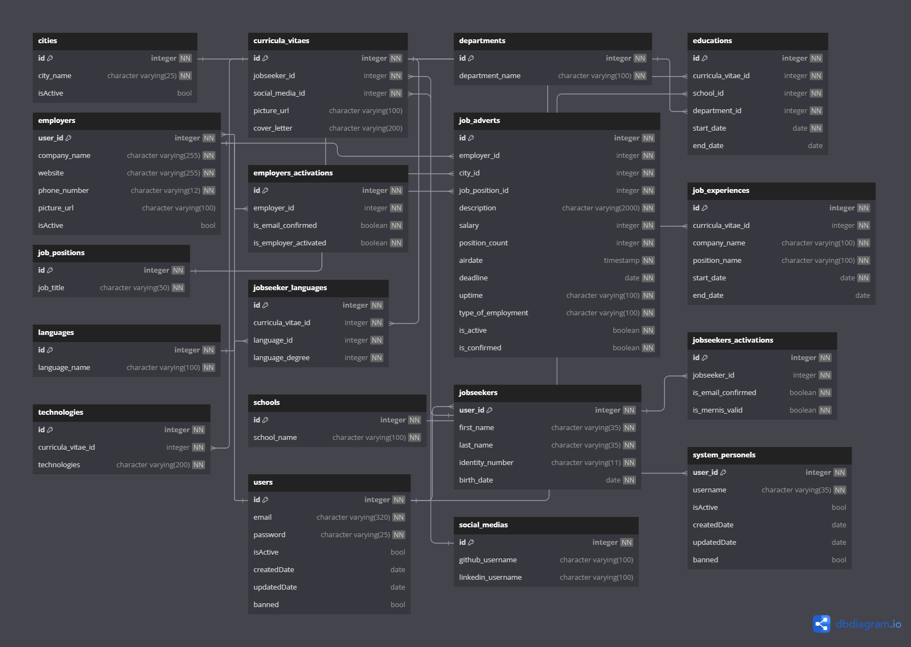

# Human Resource Management System (HRMS)

Welcome to the Human Resource Management System (HRMS) project! This system is designed to manage job seekers, employers, job advertisements, and more. It supports both Turkish and foreign users, with specific validation and activation processes for each.

## Features

- **User Registration**: Supports registration for both Turkish and foreign users. Turkish users are validated through a national ID verification system, while foreign users require admin approval.
- **Job Advertisements**: Employers can post job advertisements, which can be managed and viewed by job seekers.
- **Curriculum Vitae (CV) Management**: Job seekers can create and manage their CVs, including education, job experiences, languages, and social media profiles.
- **Admin Panel**: Admins can manage users, job advertisements, and perform necessary validations and activations.

<h2>File Directory</h2>
<ul>
    <li><b>Real Person Checker System (KPS)  </b></li>
        <ul>
            <li><a href='https://github.com/enesbiroll/hrms-backend-nodejs/blob/main/src/core/validations/soap/soapValidator.js'> KPS SoapService </a>            </li>
        </ul>
    <li><b>Main</b></li>
        <ul>
            <li><a href='https://github.com/enesbiroll/hrms-backend-nodejs/blob/main/app.js'> App File </a></li>
        </ul>
    <li><b>Core</b></li>
        <ul>
            <li>Validations</li>
                <ul>
                    <li><a href="https://github.com/enesbiroll/hrms-backend-nodejs/tree/main/src/core/validations">Validations</a></li>
                </ul>
            <li>Utils</li>
                <ul>
                    <li><a href="https://github.com/enesbiroll/hrms-backend-nodejs/tree/main/src/core/utils">Utils</a></li>
                </ul>
        </ul>
    <li><b>Services</b></li>
        <ul>
            <li>Auth</li>
                <ul>
                    <li><a href="https://github.com/enesbiroll/hrms-backend-nodejs/tree/main/src/service">JobPositionDao.java</a></li>
                </ul>
        </ul>
    <li><b>Route</b></li>
        <ul>
            <li>Routes</li>
                <ul>
                    <li><a href="https://github.com/enesbiroll/hrms-backend-nodejs/tree/main/src/routes">routes</a></li>
                </ul>
        </ul>
    <li><b>Controllers</b></li>
        <ul>
            <li><a href='https://github.com/enesbiroll/hrms-backend-nodejs/tree/main/src/controller'> Controllers </a>            </li>
        </ul> <br>
     
 <br>
    <details>
        <summary>Database Diagram</summary>
        </img>
    </details>
    <br>
    <br>
    <hr>
    
<ul>
<br>

## Getting Started
<br>

To get started with the HRMS project, follow these steps:

1. **Clone the repository**:
    ```bash
    git clone https://github.com/yourusername/hrms.git
    cd hrms
    ```

2. **Install dependencies**:
    ```bash
    npm install
    ```

3. **Set up the database**:
    - Create a MySQL database and run the SQL script provided above to create the necessary tables.

4. **Configure environment variables**:
    - Create a `.env` file and add the necessary environment variables (e.g., database connection details, JWT secret).

5. **Run the application**:
    ```bash
    npm start
    ```

## Contributing

We welcome contributions to the HRMS project! If you have any suggestions or improvements, please feel free to open an issue or submit a pull request.


## License

This project is licensed under the MIT License.